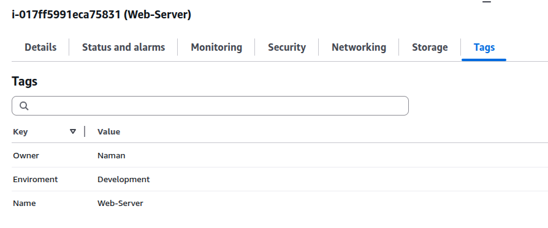
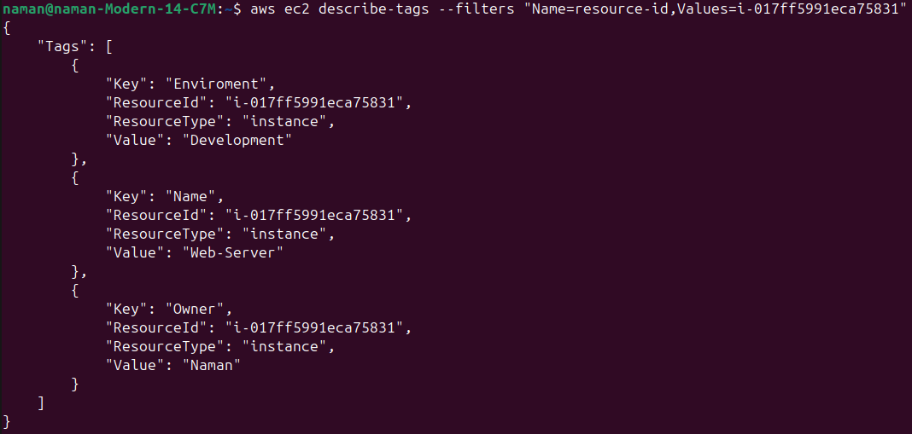

# Project 12: Tagging EC2 Instances

## Objective
Learn how to use tags in EC2 for better identification and organization.

---

## Steps
1. Launch an EC2 instance.
2. Go to the **Tags** tab and add custom tags:
   - Key: `Name`, Value: `Web-Server`
   - Key: `Environment`, Value: `Development`
   - Key: `Owner`, Value: `Naman`
3. Save the tags and verify them in the EC2 console.
4. Use the **filter by tags** option to quickly search for instances.

---

## Screenshots
- Tags added in EC2 console

- Instances filtered by tag

- Terminal output

---

## Key Learnings
- Tags are key-value pairs used for identification
- Tags help with filtering and grouping
- Naming conventions improve AWS resource management
